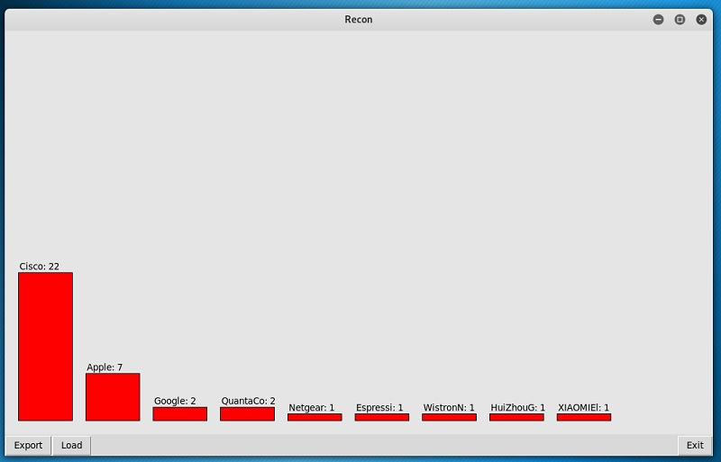

# Blockade-Recon | Jack Nelson, 2020

This tool captures MAC addresses from wireless data and tallys them based on manufacturer. Data can be imported and exported for use over multiple sessions. Useful for auditing wireless devices that are active at a location.



## Dependancies
* tcpdump

## Usage Overview

Requires a wireless adapter capable of monitor mode.

```
usage: recon.py [-h] [-i INTERFACE] [-u]

Blockade-Recon 0.1

optional arguments:
  -h, --help            show this help message and exit
  -i, --interface 		Specify a wireless interface to listen on
  -u, --updatedb        Attempt to retrieve an updated version of the
                        manufacturer database
```

The following setup assumes use with Kali.

1. Clone the repository
2. Connect your wireless card, bring up the interface and start monitor mode. Example using airmon-ng (replace "wlan0" with the name of your interface:
```
root@kali:~# ip link set dev wlan0 up
root@kali:~# airmon-ng check kill
root@kali:~# airmon-ng start wlan0
```
3. Start blockade-recon with:
```
root@kali:~/blockade-recon# ./recon.py -i <interfacename>
```
4. Wait for preliminary data to be captured.


